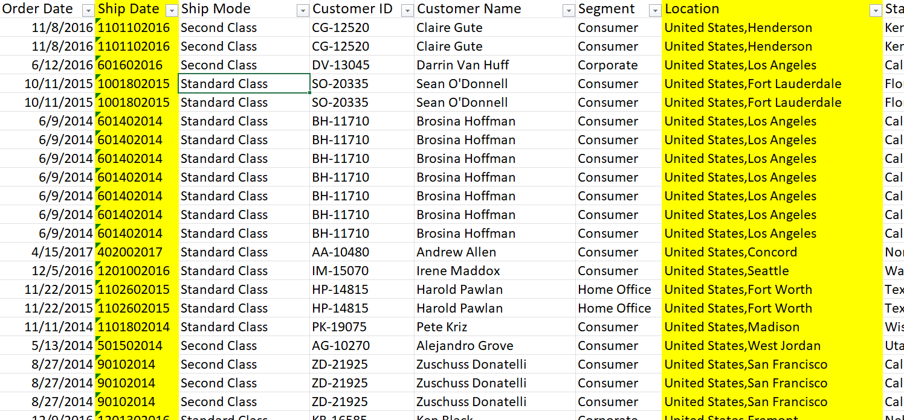
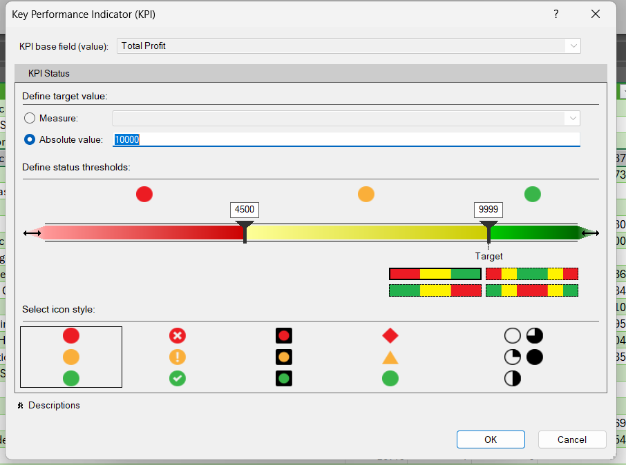
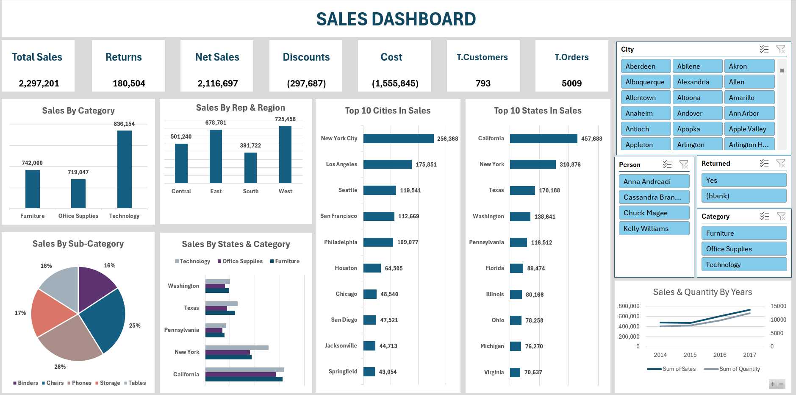

# Youtube-Data-Analysis-Course-Project
In this course, I learned the fundamentals of data analysis using Excel. This project served as the final assignment for the course.

- [Course Link :](https://www.youtube.com/watch?v=mV8s55-6mag&list=PLXlHqMRg9lAbetpJy3ePXsN0sj9Zs-pvT) 

**In this project i made analysis to answer qusetions under this scope:**

### Scope 
- Customer Loyalty 
- Strengths and Weak Points 
- Performance
- Customer Experience 

### DateSet : 

### Our KPIs :

### Final Dashboard :

